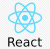

# Tezos testnet faucet

## Presentation

One-click faucet for Tezos testnets.

Currently supported:
- Ithacanet

## URL

Deployed on https://tezos-testnet-faucet.netlify.app.

[](https://app.netlify.com/sites/tezos-testnet-faucet/deploys)

## Deep inside

### Made with

 |  |  |  |  | 
---|---|---|---|---|---
React | Parcel | Typescript | Taquito | Beacon wallet | React Bootstrap


### Config

Config file is `Config.tsx`.

Update this file to plug the faucet on another testnet.

Create a new `const` with testnet parameters:

```
const IthacanetConfig = {
    "name": "Ithacanet",
    "rpcUrl": "https://ithacanet.smartpy.io",
    "faucetAddress": "tz1cpdS3qoQBYCGohszPWS8Gdya6Wg2e4JnL",
    "balanceMax": 5,
    "viewer": "https://ithaca.tzstats.com",
    "checksum": "xxx",
    "allowSendButton": true,
    "networkType": NetworkType.ITHACANET
};
```

- ```name```: the application name, to be displayed on both web page and wallet when asking for connection.
- ```rpcUrl```: the RPC endpoint to connect to
- ```faucetAddress```: faucet public address
- ```balanceMax```: maximum balance fo a wallet to request a ꜩ.
- ```viewer```: URL of a viewer that allow to display operation detail like `http://viewer-url.com/{tx_hash}`
- ```allowSendButton```: `true` to display a button to create a tx that send 1 ꜩ from user to faucet, `false` otherwise
- ```networkType```: a constant from @airgap/beacon-sdk/NetworkType that represent the testnet

Then use this new object to be returned as `network` field of `Config` export:

```
const Config = { application: ApplicationConfig, network: IthacanetConfig };
```

### Backend

This front-end faucet uses a backend to manage secrets. Please refer to backend project (if you are allowed to) to update testnet secret configuration.


## Deploy

Download
```
git clone git@github.com:avysel/tezos-testnet-faucet.git
cd tezos-testnet-faucet
```

Install
```
npm install
```

### Locally

Build for local
``` 
npm run build
```

Run on local server
```
npm run start
```

Port can be set with environment variable:
```
PORT=3000
```

Default is `1234`.

### To Github Pages

Deploy static build to Github Pages on branch `gh-pages`:

Build for deploy
```
npm run predeploy
```

Deploy on Github Pages
```
npm run deploy
```

Warning: the build uses `react-router-dom`, not compliant with Github Pages. There may be some bugs in navigation.

So, `gh-pages` is more used as a repository to deploy to Netlify.

### To Netlify

Netlify listens to `gh-pages` branch and will automatically deploy when content is updated.

### Build and deploy with Docker

Use current `Dockerfile` to create a build then deploy it.

Build Docker image:

```
docker build . -t tezos-ithacanet-faucet
```

Run Docker image:
```
docker run -p 80:80 tezos-ithacanet-faucet
```


### Deploy static build with Docker

First, build locally: 
```
npm run build
```

Then create a `Dockerfile` with

```
FROM nginx:stable-alpine
RUN npm run build
COPY dist/ /usr/share/nginx/html
```

And build & run it as above.